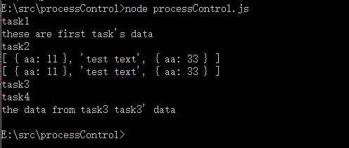

# processControl.js

## js异步解决方案

js异步解决方案已经很多了,各家都有各家的好处

受到gulp的api，和koa, eventproxy的等启发,决定造一个新轮子

### 这套api怎么玩？

非常简单, 你只需要定义一个 task, 系统会自动的安装task的定义方式执行
并且可以传递参数

一共只有四个api

| api    |  说明  |
| :------------- | :------------- |
| ProcessControl      | 用于创建一个流程控制      |
| task      | 定义一个任务       |
| next      | 用户使用next控制task的执行和任务直接的数据传递      |
| run      |  让所有的任务按顺序run      |
| UtilsConcurrentTasks       | 提供的异步并发访问工具      |

**目前实现的功能:**
- 任务的异常按流程执行
- 提供异步并发访问
- 任务间的数据传递

**todo:**
- 模块打包
- 增加web 链接数据库的demo
- 改进文档
- 测试分离
- 还有其他等等

> 注意 processControl 并不会帮你捕获一些异常，在定义任务的时候，你可以完全自己处理，而不是
交个processContro处理，因为没必要，而且processControl本身就单纯的想提高一个控制流服务，
比如给出的并发处理 就把它当成第三方加入processControl, 而不让它参与对象状态的维持(其实就是里面
不出现this)


看 demo  

```js
//启动一个流程控制
//注意: next必须放在函数结束末尾

var processControl = new ProcessControl()

processControl.task("task1", function(next, firstData) {

	setTimeout(function() {
		console.log('task1')
		console.log(firstData.data)
		next(true)
	}, 1000)
})

processControl.task("task2", function(next) {

	setTimeout(function() {
		console.log('task2')
		next(true)
	}, 1000)
})


//并入并发的用法
// processControl.concurrentTasks 只是我们提供的方便开发者容易调用的并发api
// 在流程控制中 需要将其用task 接入

processControl.task('concurrentTasks', function(next) {

	// concurrentTask1, concurrentTask2, concurrentTask3 为一个个异步函数 结果按
	//顺序返回数组
	processControl.UtilsConcurrentTasks(concurrentTask1, concurrentTask2, concurrentTask3, function(err, data) {
			if (err) {
				throw 'concurrentTasks error'
				next(false)
			} else {
				console.log(data)
				next(true, data)
			}
	})
})

processControl.task("task3", function(next, receiveDataFromLastTask) {

	console.log(receiveDataFromLastTask)

	for (var i = 0; i < 1000000; i++) {
		var j = j * 2
	}
	console.log('task3')
	next(true, {"data": "task3' data"})
})


processControl.task("task4", function(next, receiveDataFromLastTask) {

	for (var i = 0; i < 1000000; i++) {
		var j = j * 2
	}
	console.log('task4')
	console.log('the data from task3', receiveDataFromLastTask.data)
	next(true)
	// next(true)
})

processControl.run({"data": "these are first task's data"})

```
补充上面的未定义函数

```js

function concurrentTask1(callback) {
	setTimeout(function() {callback(null, {"aa":11})}, 2000)
}


//整和其他异步方访问库的例子
function concurrentTask2(callback) {

	var fs = require('fs')

	// fs.readFile('test.txt', "utf8", callback)
	fs.readFile('test.txt', "utf8", function(err, data) {
		if (err) callback(err)
		else callback(null, data.toString())
	})
}

function concurrentTask3(callback) {
	setTimeout(function() {callback(null, {"aa":33})}, 100)
}

```

**异步完全变成成同步编程了**

**注意:**
- 如果建立一个流程对象，这个对象对象在运行的还没结束的时候，又执行run,它会阻止后面的执行，
继续把之前的执行完成，当然执行当前任务完成后，在继续执行是可以的
- 如果需要同时控制对个流程，那么就建立多个processControl对象

测试结果


